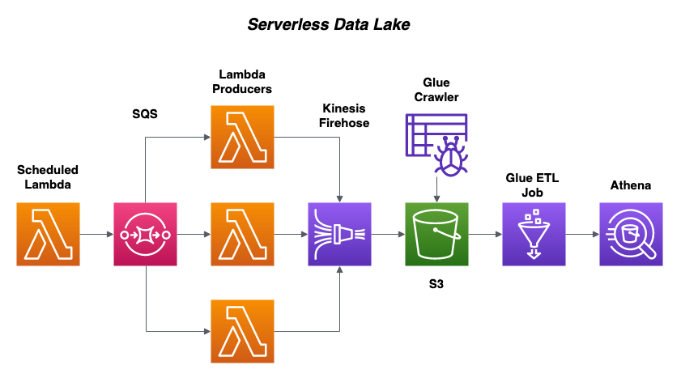

serverless-streaming-reddit-pipeline
==============================

Streams JSON data from any number of Reddit forums (subreddits) into an S3 data lake. Uses Lambdas, SQS, Kinesis Firehose, and AWS Glue to build an optimized serverless data lake which can be queried with Athena or visualized with Quicksight. 

## Description
A scheduled Lambda sends subreddits to an SQS queue and assigns them to individual Lambdas which collect all available posts for that subreddit. The JSON data is streamed to an S3 bucket using Kinesis Firehose, crawled by a Glue Crawler, converted to Parquet by a Glue ETL Job, and re-crawled. 



## Overview
```
.
├── cfn                          # CloudFormation files
│   ├── data-lake.yml            # Glue resources
│   ├── master-stack.yml         # Master stack
│   ├── pipeline.yml             # SQS & Kinesis Firehose
│   └── s3-cfn.yml               # CloudFormation Templates for nested stacks
├── config
│   └── load-subreddits.json     # List of subreddits
├── glue-scripts                 # ETL scripts
│   └── json_to_parquet.py       
├── img
│   └── architecture.png
├── scripts 
│   ├── delete_pipeline.sh       # Delete all data and resources
│   ├── deploy.sh                # Deploy to AWS
│   ├── set_env.sh               # API credentials go here
│   └── set_parameters.sh
├── src
│   └── functions
│       └── pipeline
│           ├── handler.py       # Lambda functions
│           ├── libs             # Libraries for Lambda functions
│           │   ├── __init__.py
│           │   ├── dict_smasher.py
│           │   ├── sqs_utils.py
│           │   └── utils.py
│           ├── requirements.txt # for serverless-python-requirements plugin
│           └── serverless.yml   # Serverless Framework
├── .gitignore
└── README.md
```

## Getting Started

### Prerequisites
* [awscli](https://docs.aws.amazon.com/cli/latest/userguide/install-cliv2.html) and [credentials](https://docs.aws.amazon.com/cli/latest/userguide/cli-chap-configure.html)
* [Serverless](https://www.serverless.com/framework/docs/getting-started/) framework
* [Docker](https://docs.docker.com/get-docker/)
* [Reddit API credentials](https://www.reddit.com/prefs/apps) - click the button "create another app..."

### Setting up Environment
1. Clone this repo:
   ```
   git clone \
       --branch master --single-branch --depth 1 --no-tags \
       https://github.com/abk7777/serverless-streaming-reddit-pipeline.git
   ```
2. Install Serverless Python Requirements plugin
   ```
   cd serverless-streaming-reddit-pipeline
   npm install --save serverless-python-requirements
   ```

3. Input Reddit API credentials in `scripts/set_env.sh`:
   ```
   # set_env.sh

   STAGE=prod
   APP_NAME=reddit-pipeline
   REGION=us-east-1
   ACCOUNT_ID=$(aws sts get-caller-identity --query Account --output text)
   STACK_NAME=$STAGE-$APP_NAME-$APP_VERSION-$REGION

   # Reddit API Params
   CLIENT_ID=<CLIENT_ID>
   CLIENT_SECRET=<CLIENT_SECRET>
   USERAGENT=ssrp
   USERNAME=<USERNAME>
   PASSWORD=<PASSWORD>
   ```

### Deploy AWS Infrastructure
These instructions will deploy a stack named `prod-reddit-pipeline-1-us-east-1` using AWS CloudFormation.

*Note:* The stage, app name and app version variables must coincide in `set_env.sh`, `master-stack.yml`, `s3-cfn.yml` and `serverless.yml`. 

   Run `scripts/deploy.sh` to deploy the stack:
   ```
   cd serverless-streaming-reddit-pipeline
   bash scripts/deploy.sh
   ```
The first deployment requires the SSM Parameters to be set. Serverless Framework deploys the Lambda functions:
   ```
   SSM Parameters must be set before the first deployment.
   Update SSM parameters? y
   Deploy Serverless Framework? y
   ```

### Invoke Lambda
Once the stacks have been created the pipeline is ready to be run:
   ```
   cd src/functions/pipeline
   serverless invoke --function queueSubreddits \
   --stage prod \
   --region us-east-1 \
   --log
   ```

Once `queueSubreddits` has run you can view the worker logs while they collect subreddit data in the CloudWatch log group for the `collectData` function.

### Run Glue Workflow
The default configuration is for the pipeline to run once per hour, and for the crawlers and ETL job to run once per day at midnight. To test the pipeline the workflow can be invoked using AWS CLI:
```
aws glue start-workflow-run --name prod-reddit-pipeline-1-us-east-1-json-to-parquet-workflow
```

### Querying in Athena
Example queries for table named `prod_ssrp_1_raw_reddit_posts_parquet`:
```
-- Most popular posts by number of comments and upvote ratio
SELECT MAX(upvote_ratio) AS upvote_ratio, MAX(num_comments) AS num_comments, title
FROM prod_ssrp_1_raw_reddit_posts_parquet
GROUP BY title
ORDER BY num_comments DESC, upvote_ratio DESC
LIMIT 100;
```
```
-- Most popular authors
SELECT DISTINCT author AS author, COUNT(DISTINCT title) as posts_count
FROM prod_ssrp_1_raw_reddit_posts_parquet
GROUP BY author
ORDER BY posts_count DESC
LIMIT 100;
```
```
-- Longest posts
SELECT DISTINCT title, LENGTH(selftext) AS post_length, clickable_url
FROM prod_ssrp_1_raw_reddit_posts_parquet
ORDER BY post_length DESC
LIMIT 100;
```

### Cleaning up
   Run `scripts/delete_pipeline.sh` to delete the stack (WARNING: this will delete all the data!):
   ```
   cd serverless-streaming-reddit-pipeline
   bash scripts/delete_pipeline.sh
   ```
   
## Contributors

**Primary (Contact) : [Gregory Lindsey](https://github.com/abk7777)**

[contributors-shield]: https://img.shields.io/github/contributors/abk7777/serverless-streaming-reddit-pipeline.svg?style=flat-square
[contributors-url]: https://github.com/abk7777/serverless-streaming-reddit-pipeline/graphs/contributors
[forks-shield]: https://img.shields.io/github/forks/abk7777/serverless-streaming-reddit-pipeline.svg?style=flat-square
[forks-url]: https://github.com/abk7777/serverless-streaming-reddit-pipeline/network/members
[stars-shield]: https://img.shields.io/github/stars/abk7777/serverless-streaming-reddit-pipeline.svg?style=flat-square
[stars-url]: https://github.com/abk7777/serverless-streaming-reddit-pipeline/stargazers
[issues-shield]: https://img.shields.io/github/issues/abk7777/serverless-streaming-reddit-pipeline.svg?style=flat-square
[issues-url]: https://github.com/abk7777/serverless-streaming-reddit-pipeline/issues
[license-shield]: https://img.shields.io/github/license/abk7777/serverless-streaming-reddit-pipeline.svg?style=flat-square
[license-url]: https://github.com/abk7777/serverless-streaming-reddit-pipeline/blob/master/LICENSE
[linkedin-shield]: https://img.shields.io/badge/-LinkedIn-black.svg?style=flat-square&logo=linkedin&colorB=555
[linkedin-url]: https://linkedin.com/in/gregory-lindsey/